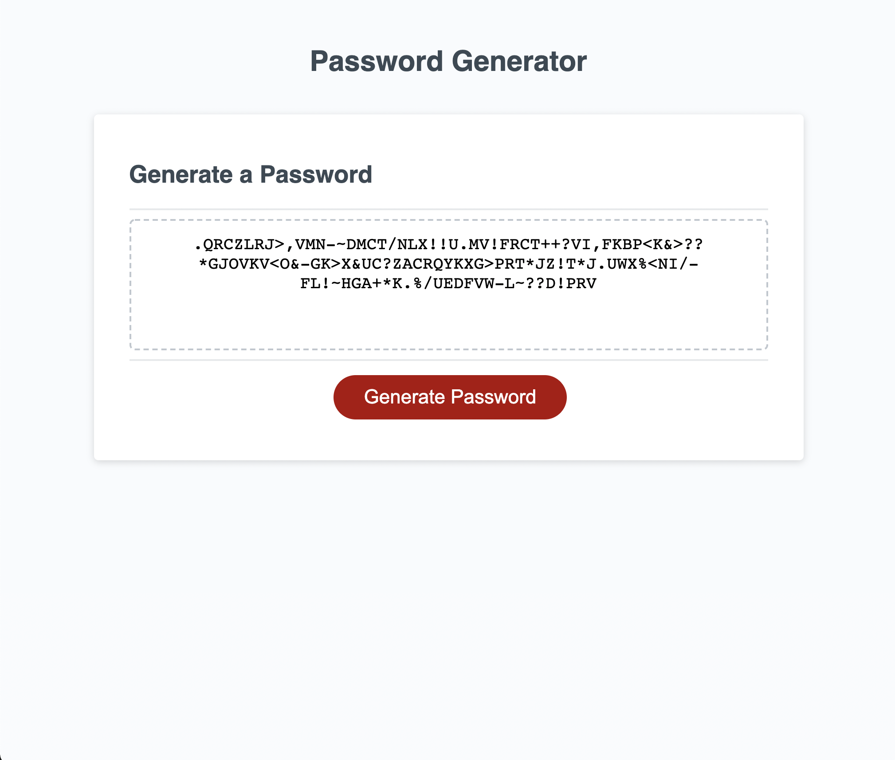

# Password-Generator

## My Task 
Create a javascript code that randomly generates a password meeting certain criteria

## How Does it function

* WHEN you click the button to generate a password, you are presented with a series of prompts for password criteria :
  * Length of password
  * Whether or not to include Uppercase, Lowercase and special character
* Length must be of at least 8 characters and no more than 128 characters otherwise you will have to choose a length again.
* At least one character type should be selected otherwise you will have to choose criteria again.
* WHEN all prompts are answered, a password is generated that matches the selected criteria.
* The password is written to the page.

## Link
https://nadinemohsen.github.io/Password-Generator/

## Screenshot

